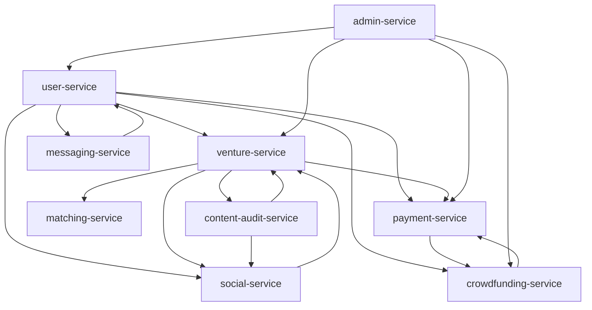
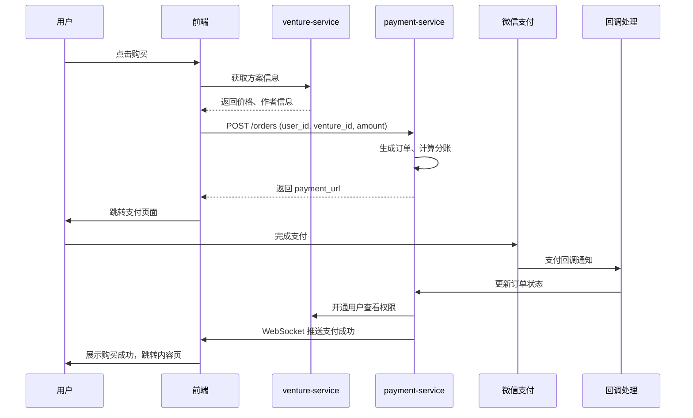
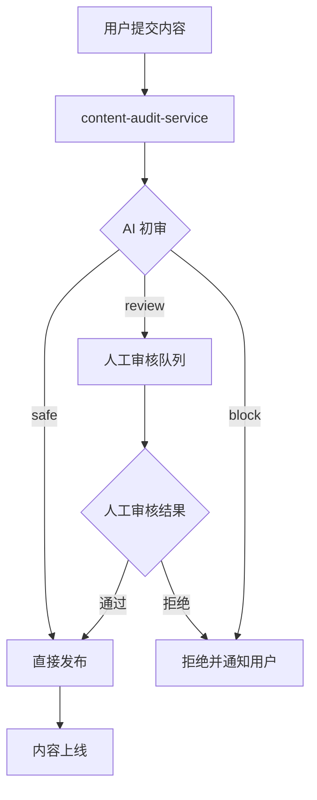
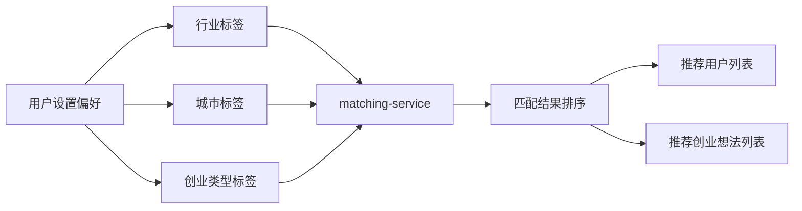
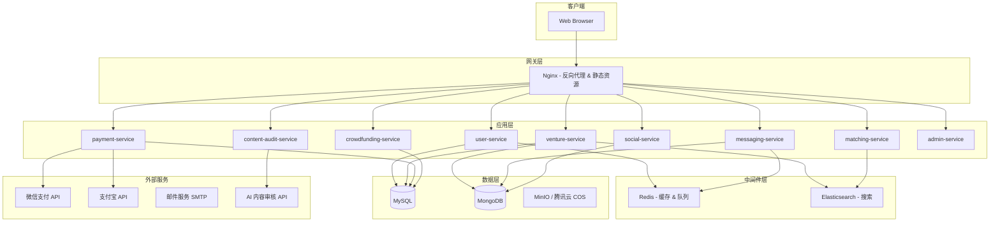

# VentureHub（创业想法交流平台）产品需求文档

> **版本**: v1.0
> **日期**: 2026-05-13
> **状态**: Draft

---

## 1. 背景（Background）

### 1.1 问题陈述

有创业想法的人群缺少一个专注、低门槛的平台来交流创业概念和方案。现有的社交平台（如微博、知乎、微信群）话题分散，缺乏结构化的创业信息组织和匹配机制。用户难以：
- 按行业、城市维度找到志同道合的人
- 安全地分享和变现自己的创业方案
- 获得创业相关的系统性讨论

### 1.2 项目目标

构建一个 Web 端创业想法交流平台，支持用户免费/付费分享创业概念和方案，并按创业类型、行业、城市进行精准匹配。

### 1.3 成功指标（KPIs）

**用户侧：**

| 指标 | 上线 3 个月 | 上线 6 个月 | 上线 12 个月 |
|------|-----------|-----------|-------------|
| 注册用户 | 3,000 | 8,000 | 20,000 |
| 日活用户（DAU） | 300 | 800 | 2,000 |
| 月活用户（MAU） | 1,500 | 4,000 | 10,000 |
| 次日留存率 | 25% | 30% | 35% |

**内容侧：**

| 指标 | 上线 3 个月 | 上线 6 个月 | 上线 12 个月 |
|------|-----------|-----------|-------------|
| 日均发布创业想法 | 15 | 40 | 100 |
| 累计创业想法 | 1,500 | 7,000 | 30,000 |
| 日均评论/讨论 | 60 | 180 | 500 |
| 付费内容占比 | 8% | 12% | 18% |
| 日均私信量 | 30 | 80 | 200 |

### 1.4 术语表（Glossary）

| 术语 | 英文 | 说明 |
|------|------|------|
| 创业想法 | Idea / Venture Idea | 用户发布的一个创业概念或讨论主题 |
| 创业方案 | Venture Plan | 结构化的创业规划文档，可设置为免费或付费 |
| 众筹项目 | Crowdfunding Project | 用户发起的项目众筹，用于验证市场需求或筹集启动资金 |
| 导师 | Mentor | 平台认证的创业指导者 |
| 投资人 | Investor | 平台认证的投资方 |

---

## 2. 用户故事（User Stories）

### 2.1 用户画像（Personas）

| 画像 | 描述 | 核心诉求 |
|------|------|----------|
| **创业新人** | 有想法但缺乏经验，想找人讨论、验证 | 低成本验证想法、找到合伙人 |
| **经验创业者** | 有一定经验，想分享方案或寻找新项目 | 变现知识、拓展人脉 |
| **投资人/导师** | 寻找优质项目和团队 | 高效筛选、直接沟通 |

### 2.2 故事列表

#### P0（Must-have，上线必备）

**US-01：用户注册与登录**
> 作为 访客，我希望 通过邮箱或手机号注册账号并登录，以便 使用平台功能。

- **验收标准（Gherkin）：**
  - `Given` 访客在注册页面
  - `When` 输入有效邮箱、密码并提交
  - `Then` 系统发送验证邮件，验证后账号激活
  - `Given` 已注册用户
  - `When` 输入正确凭证登录
  - `Then` 进入首页，获得 JWT Token
  - `Given` 用户连续 5 次输入错误密码
  - `Then` 账号锁定 15 分钟
  - `Given` 用户使用未验证邮箱登录
  - `Then` 提示"请先验证邮箱"

**US-02：发布创业想法（CRUD）**
> 作为 已登录用户，我希望 创建、编辑、删除我的创业想法，以便 分享和交流。

- **验收标准（Gherkin）：**
  - `Given` 已登录用户在发布页面
  - `When` 填写标题、类型、行业、城市、内容并提交
  - `Then` 创业想法发布成功，出现在列表页
  - `Given` 作者查看自己的创业想法
  - `When` 点击编辑并修改内容提交
  - `Then` 内容更新，显示"已编辑"标记
  - `Given` 作者查看自己的创业想法
  - `When` 点击删除并确认
  - `Then` 该想法被软删除（Soft Delete），不再公开显示
  - `Given` 用户尝试编辑他人发布的创业想法
  - `Then` 系统返回 403 Forbidden

**US-03：评论与讨论**
> 作为 已登录用户，我希望 对创业想法发表评论，以便 参与讨论。

- **验收标准（Gherkin）：**
  - `Given` 用户在创业想法详情页
  - `When` 输入评论内容并提交
  - `Then` 评论出现在评论区，按时间倒序排列
  - `Given` 评论作者查看自己的评论
  - `When` 点击删除
  - `Then` 评论被移除
  - `Given` 用户输入空评论或超 5000 字
  - `Then` 系统提示输入无效

**US-04：按行业/城市筛选匹配**
> 作为 已登录用户，我希望 按行业和城市筛选创业想法和用户，以便 找到志同道合的人。

- **验收标准（Gherkin）：**
  - `Given` 用户在探索页面
  - `When` 选择"互联网"行业 + "深圳"城市
  - `Then` 展示该行业+城市下的创业想法和用户列表
  - `Given` 筛选结果为空
  - `Then` 显示"暂无匹配结果，试试扩大筛选范围"

**US-05：私信聊天**
> 作为 已登录用户，我希望 与其他用户私信沟通，以便 深入交流创业想法。

- **验收标准（Gherkin）：**
  - `Given` 用户在用户主页
  - `When` 点击"发私信"并输入内容发送
  - `Then` 消息发送成功，对方收到通知
  - `Given` 用户收到私信
  - `When` 打开私信列表
  - `Then` 显示未读消息红点，支持实时消息推送（WebSocket）
  - `Given` 用户被对方拉黑
  - `Then` 无法向对方发送私信，提示"对方已设置不接收你的消息"

#### P1（Should-have，上线后快速迭代）

**US-06：付费内容购买**
> 作为 已登录用户，我希望 购买付费创业方案，以便 获取深度内容。

- **验收标准（Gherkin）：**
  - `Given` 用户在付费方案详情页
  - `When` 点击购买并通过微信/支付宝完成支付
  - `Then` 获得方案查看权限，平台抽取 10%-20% 提成
  - `Given` 用户已购买某方案
  - `When` 再次访问该方案
  - `Then` 直接查看，无需重复支付
  - `Given` 支付过程中网络中断
  - `Then` 系统轮询支付状态，成功后自动开通权限

**US-07：项目众筹**
> 作为 已登录用户，我希望 发起或参与项目众筹，以便 验证市场需求或筹集启动资金。

- **验收标准（Gherkin）：**
  - `Given` 用户在众筹页面
  - `When` 填写项目信息、目标金额、回报方案并提交审核
  - `Then` 审核通过后项目上线
  - `Given` 用户在众筹项目页
  - `When` 选择支持金额并完成支付
  - `Then` 支持成功，记录在支持者列表中

#### P2（Nice-to-have，中长期规划）

**US-08：创业导师对接**
> 作为 已登录用户，我希望 预约创业导师，以便 获得专业指导。

**US-09：投资人匹配**
> 作为 投资人，我希望 浏览并筛选优质创业项目，以便 发现投资机会。

### 2.3 明确不做（Non-Goals）

- 股权交易、股权登记
- 创业担保、借贷服务
- 线下孵化器运营
- 移动端原生 App（首版仅 Web 端）
- 商业化定价策略（本 PRD 不涉及具体定价）

---

## 3. 模块设计（Module Design）

### 3.1 模块总览

```
venturehub/
├── user-service/          # 用户模块（注册、登录、资料管理）
├── venture-service/       # 创业想法模块（CRUD、分类、搜索）
├── payment-service/       # 支付模块（付费方案购买、众筹、分账）
├── messaging-service/     # 消息模块（私信、系统通知、WebSocket）
├── social-service/        # 社交模块（评论、点赞、关注）
├── crowdfunding-service/  # 众筹模块（项目管理、支持记录）
├── matching-service/      # 匹配模块（行业/城市筛选、推荐）
├── content-audit-service/ # 内容审核模块（敏感词过滤、AI 审核）
└── admin-service/         # 管理后台模块（用户管理、内容管理、数据统计）
```

### 3.2 模块依赖关系



### 3.3 深度模块（Deep Modules）

| 模块 | 封装复杂度 | 对外接口 | 理由 |
|------|-----------|----------|------|
| **content-audit-service** | 敏感词库管理、AI 模型调用、审核策略配置 | `audit(text, type) -> AuditResult` | 审核规则复杂且持续迭代，但对外接口极简 |
| **payment-service** | 微信/支付宝对接、分账逻辑、退款流程、对账 | `createOrder(OrderRequest) -> OrderResult` | 支付链路细节多，封装后业务层只需关注订单 |

### 3.4 模块接口定义

**content-audit-service：**

```
audit(content: str, content_type: Enum["venture", "comment", "message"]) -> AuditResult
  AuditResult {
    passed: bool
    risk_level: Enum["safe", "review", "block"]
    matched_keywords: list[str]
    suggested_action: Enum["pass", "manual_review", "reject"]
  }
```

**payment-service：**

```
create_order(user_id: UUID, product_id: UUID, amount: Decimal, channel: Enum["wechat", "alipay"]) -> OrderResult
  OrderResult {
    order_id: UUID
    payment_url: str
    status: Enum["pending", "paid", "expired", "refunded"]
  }

query_order(order_id: UUID) -> OrderResult
handle_callback(raw_data: dict) -> bool  # 支付回调处理
```

---

## 4. 流程设计（Process Design）

### 4.1 付费方案购买流程



### 4.2 内容审核流程



### 4.3 用户匹配流程



---

## 5. 技术栈（Technology Stack）

| 层级 | 技术选型 | 版本 | 选型理由 |
|------|----------|------|----------|
| 前端框架 | React | 19 | 最新稳定版，支持 Server Components、并发渲染 |
| UI 组件库 | Ant Design | 6.3.x | 企业级中后台首选，与 React 19 兼容 |
| 状态管理 | Zustand | 5.x | 轻量、无样板代码，比 Redux 更简洁 |
| 前端构建 | Vite | 6.x | 比 Webpack 快 10x+ 的开发体验 |
| 后端框架 | FastAPI | 0.115+ | 异步支持、自动生成 OpenAPI 文档、类型安全 |
| 运行时 | Python | 3.12 | 最新稳定版，性能提升显著 |
| 关系数据库 | MySQL | 8.0+ | 用户、订单、支付等结构化数据 |
| 文档数据库 | MongoDB | 7.0+ | 创业想法内容、评论等半结构化数据 |
| 缓存 | Redis | 7.x | 会话管理、热点数据缓存、消息队列 |
| 消息队列 | Redis Streams / RabbitMQ | - | 异步任务（审核、通知） |
| 搜索引擎 | Elasticsearch | 8.x | 全文搜索、标签筛选、推荐匹配 |
| 对象存储 | MinIO（开发）/ 腾讯云 COS（生产） | - | 图片、文件存储 |
| 反向代理 | Nginx | 1.25+ | 静态资源、负载均衡 |
| 容器化 | Docker + Docker Compose | - | 统一开发/部署环境 |
| CI/CD | GitHub Actions | - | 自动化构建、测试、部署 |

---

## 6. 架构设计（Architecture Design）

### 6.1 系统架构



### 6.2 部署架构

| 阶段 | 环境 | 方案 |
|------|------|------|
| 开发阶段 | 自建服务器（飞牛 NAS + 1Panel） | Docker Compose 单机部署所有服务 |
| 生产阶段 | 腾讯云 | CVM + 容器服务，MySQL/MongoDB 使用云数据库 |

### 6.3 关键设计决策

- **服务间通信**：初期采用同步 HTTP（FastAPI 内置），后续可按需引入消息队列解耦
- **实时消息**：WebSocket 长连接，Redis Pub/Sub 实现跨实例消息推送
- **认证授权**：JWT（JSON Web Token） + RBAC（Role-Based Access Control）权限模型
- **文件上传**：前端直传对象存储获取预签名 URL，减轻后端压力

---

## 7. 数据库设计（Database Design）

### 7.1 MySQL 表结构

**users（用户表）**

| 字段 | 类型 | 约束 | 说明 |
|------|------|------|------|
| id | CHAR(36) | PK | UUID v7 |
| email | VARCHAR(255) | UNIQUE, NOT NULL | 邮箱 |
| phone | VARCHAR(20) | UNIQUE, NULLABLE | 手机号 |
| password_hash | VARCHAR(255) | NOT NULL | bcrypt 哈希 |
| nickname | VARCHAR(50) | NOT NULL | 昵称 |
| avatar_url | VARCHAR(500) | NULLABLE | 头像 URL |
| city | VARCHAR(50) | NULLABLE | 所在城市 |
| industry | VARCHAR(50) | NULLABLE | 所属行业 |
| bio | TEXT | NULLABLE | 个人简介 |
| role | ENUM('user','mentor','investor','admin') | DEFAULT 'user' | 角色 |
| status | ENUM('active','locked','deleted') | DEFAULT 'active' | 状态 |
| email_verified | BOOLEAN | DEFAULT FALSE | 邮箱是否已验证 |
| created_at | DATETIME | NOT NULL | 创建时间 |
| updated_at | DATETIME | NOT NULL | 更新时间 |

**Indexes:** `idx_users_email`, `idx_users_city`, `idx_users_industry`, `idx_users_role`

---

**ventures（创业想法表 - 元数据部分，内容存 MongoDB）**

| 字段 | 类型 | 约束 | 说明 |
|------|------|------|------|
| id | CHAR(36) | PK | UUID v7 |
| author_id | CHAR(36) | FK -> users.id | 作者 |
| title | VARCHAR(200) | NOT NULL | 标题 |
| venture_type | ENUM('concept','plan','discussion') | NOT NULL | 类型 |
| industry | VARCHAR(50) | NOT NULL | 行业标签 |
| city | VARCHAR(50) | NULLABLE | 城市标签 |
| price | DECIMAL(10,2) | DEFAULT 0.00 | 价格，0 表示免费 |
| content_ref | VARCHAR(36) | NOT NULL | MongoDB 文档 ID |
| view_count | INT | DEFAULT 0 | 浏览次数 |
| comment_count | INT | DEFAULT 0 | 评论数（冗余计数） |
| status | ENUM('published','draft','auditing','deleted') | DEFAULT 'auditing' | 状态 |
| is_deleted | BOOLEAN | DEFAULT FALSE | 软删除标记 |
| created_at | DATETIME | NOT NULL | 创建时间 |
| updated_at | DATETIME | NOT NULL | 更新时间 |

**Indexes:** `idx_ventures_author`, `idx_ventures_industry_city`, `idx_ventures_type`, `idx_ventures_status`

---

**orders（订单表）**

| 字段 | 类型 | 约束 | 说明 |
|------|------|------|------|
| id | CHAR(36) | PK | UUID v7 |
| buyer_id | CHAR(36) | FK -> users.id | 购买者 |
| seller_id | CHAR(36) | FK -> users.id | 卖方（方案作者） |
| venture_id | CHAR(36) | FK -> ventures.id | 购买的方案 |
| amount | DECIMAL(10,2) | NOT NULL | 订单金额 |
| platform_fee | DECIMAL(10,2) | NOT NULL | 平台抽成（10%-20%） |
| seller_amount | DECIMAL(10,2) | NOT NULL | 卖方所得 |
| channel | ENUM('wechat','alipay') | NOT NULL | 支付渠道 |
| status | ENUM('pending','paid','expired','refunded') | DEFAULT 'pending' | 状态 |
| paid_at | DATETIME | NULLABLE | 支付时间 |
| created_at | DATETIME | NOT NULL | 创建时间 |

**Indexes:** `idx_orders_buyer`, `idx_orders_seller`, `idx_orders_venture`, `idx_orders_status`

---

**crowdfunding_projects（众筹项目表）**

| 字段 | 类型 | 约束 | 说明 |
|------|------|------|------|
| id | CHAR(36) | PK | UUID v7 |
| creator_id | CHAR(36) | FK -> users.id | 发起人 |
| title | VARCHAR(200) | NOT NULL | 项目名称 |
| description | TEXT | NOT NULL | 项目描述 |
| target_amount | DECIMAL(12,2) | NOT NULL | 目标金额 |
| raised_amount | DECIMAL(12,2) | DEFAULT 0.00 | 已筹金额 |
| supporter_count | INT | DEFAULT 0 | 支持人数 |
| start_date | DATETIME | NOT NULL | 开始时间 |
| end_date | DATETIME | NOT NULL | 结束时间 |
| status | ENUM('draft','reviewing','active','completed','failed','cancelled') | DEFAULT 'draft' | 状态 |
| created_at | DATETIME | NOT NULL | 创建时间 |

**Indexes:** `idx_cf_creator`, `idx_cf_status`, `idx_cf_end_date`

---

**crowdfunding_supports（众筹支持记录表）**

| 字段 | 类型 | 约束 | 说明 |
|------|------|------|------|
| id | CHAR(36) | PK | UUID v7 |
| project_id | CHAR(36) | FK -> crowdfunding_projects.id | 项目 |
| supporter_id | CHAR(36) | FK -> users.id | 支持者 |
| amount | DECIMAL(10,2) | NOT NULL | 支持金额 |
| order_id | CHAR(36) | FK -> orders.id | 关联订单 |
| created_at | DATETIME | NOT NULL | 支持时间 |

---

**messages（私信表 - 元数据，内容存 MongoDB）**

| 字段 | 类型 | 约束 | 说明 |
|------|------|------|------|
| id | CHAR(36) | PK | UUID v7 |
| sender_id | CHAR(36) | FK -> users.id | 发送者 |
| receiver_id | CHAR(36) | FK -> users.id | 接收者 |
| content_ref | VARCHAR(36) | NOT NULL | MongoDB 文档 ID |
| is_read | BOOLEAN | DEFAULT FALSE | 是否已读 |
| created_at | DATETIME | NOT NULL | 发送时间 |

**Indexes:** `idx_msg_sender_receiver`, `idx_msg_receiver_read`

---

**block_list（拉黑表）**

| 字段 | 类型 | 约束 | 说明 |
|------|------|------|------|
| id | CHAR(36) | PK | UUID v7 |
| blocker_id | CHAR(36) | FK -> users.id | 拉黑者 |
| blocked_id | CHAR(36) | FK -> users.id | 被拉黑者 |
| created_at | DATETIME | NOT NULL | 拉黑时间 |

**Indexes:** `UNIQUE idx_block_pair (blocker_id, blocked_id)`

### 7.2 MongoDB 集合设计

**venture_contents**

```json
{
  "_id": "ObjectId",
  "venture_id": "UUID (MySQL ventures.id)",
  "content": "Markdown 正文",
  "images": ["url1", "url2"],
  "attachments": [
    {"name": "商业计划书.pdf", "url": "cos://...", "size": 2048000}
  ],
  "tags": ["SaaS", "AI", "B2B"],
  "version": 1,
  "created_at": "ISODate",
  "updated_at": "ISODate"
}
```

**comments**

```json
{
  "_id": "ObjectId",
  "venture_id": "UUID",
  "author_id": "UUID",
  "content": "评论内容",
  "parent_id": "ObjectId | null",
  "status": "published | deleted",
  "created_at": "ISODate"
}
```

**message_contents**

```json
{
  "_id": "ObjectId",
  "message_id": "UUID (MySQL messages.id)",
  "content_type": "text | image | file",
  "text": "消息正文",
  "attachment_url": "url | null",
  "created_at": "ISODate"
}
```

### 7.3 索引策略

| 数据库 | 索引 | 用途 |
|------|------|------|
| MySQL | `idx_ventures_industry_city` 联合索引 | 行业+城市筛选查询 |
| MySQL | `idx_orders_buyer` + `idx_orders_status` | 用户购买记录查询 |
| MongoDB | `venture_contents.venture_id` 唯一索引 | 方案内容关联查询 |
| MongoDB | `comments.venture_id` + `comments.created_at` 复合索引 | 评论列表查询 |
| Elasticsearch | 全量索引 ventures 标题、标签、行业、城市 | 全文搜索 + 推荐匹配 |

### 7.4 数据迁移计划

- 使用 Alembic 管理 MySQL Schema 版本迁移
- MongoDB 采用 Code-First 方式，服务启动时自动创建索引
- 生产环境迁移前先在 Staging 环境验证

---

## 8. API 设计（API Design）

### 8.1 规范

- 协议：RESTful，JSON 格式
- 认证：Bearer Token（JWT），Header `Authorization: Bearer <token>`
- 版本：URL 路径版本 `/api/v1/`
- 分页：`?page=1&page_size=20`，响应含 `total`、`has_next`
- 错误格式：`{"error": {"code": "VALIDATION_ERROR", "message": "..."}}`

### 8.2 端点清单

#### 用户模块 `/api/v1/users`

| 方法 | 路径 | 说明 | 认证 |
|------|------|------|------|
| POST | `/auth/register` | 注册 | 否 |
| POST | `/auth/login` | 登录 | 否 |
| POST | `/auth/verify-email` | 验证邮箱 | 否 |
| POST | `/auth/refresh` | 刷新 Token | 否 |
| GET | `/me` | 获取当前用户信息 | 是 |
| PUT | `/me` | 更新个人资料 | 是 |
| GET | `/{user_id}` | 获取用户公开资料 | 否 |
| GET | `/search` | 按行业/城市搜索用户 | 否 |

#### 创业想法模块 `/api/v1/ventures`

| 方法 | 路径 | 说明 | 认证 |
|------|------|------|------|
| GET | `/` | 创业想法列表（支持筛选） | 否 |
| GET | `/{id}` | 详情（付费内容需鉴权） | 视情况 |
| POST | `/` | 创建创业想法 | 是 |
| PUT | `/{id}` | 更新（仅作者） | 是 |
| DELETE | `/{id}` | 软删除（仅作者） | 是 |
| GET | `/search` | 全文搜索 | 否 |

#### 评论模块 `/api/v1/comments`

| 方法 | 路径 | 说明 | 认证 |
|------|------|------|------|
| GET | `/ventures/{id}` | 获取某想法的评论列表 | 否 |
| POST | `/ventures/{id}` | 发表评论 | 是 |
| DELETE | `/{id}` | 删除评论 | 是 |

#### 支付模块 `/api/v1/payments`

| 方法 | 路径 | 说明 | 认证 |
|------|------|------|------|
| POST | `/orders` | 创建订单 | 是 |
| GET | `/orders/{id}` | 查询订单状态 | 是 |
| GET | `/orders/mine` | 我的订单列表 | 是 |
| POST | `/callbacks/wechat` | 微信支付回调 | 否（签名验证） |
| POST | `/callbacks/alipay` | 支付宝回调 | 否（签名验证） |

#### 私信模块 `/api/v1/messages`

| 方法 | 路径 | 说明 | 认证 |
|------|------|------|------|
| GET | `/conversations` | 会话列表 | 是 |
| GET | `/conversations/{user_id}` | 与某用户的聊天记录 | 是 |
| POST | `/` | 发送消息 | 是 |
| WS | `/ws` | WebSocket 实时消息 | 是 |

#### 众筹模块 `/api/v1/crowdfunding`

| 方法 | 路径 | 说明 | 认证 |
|------|------|------|------|
| GET | `/projects` | 众筹项目列表 | 否 |
| GET | `/projects/{id}` | 项目详情 | 否 |
| POST | `/projects` | 发起众筹 | 是 |
| POST | `/projects/{id}/support` | 支持项目 | 是 |

#### 管理后台 `/api/v1/admin`

| 方法 | 路径 | 说明 | 认证 |
|------|------|------|------|
| GET | `/stats/overview` | 平台概览数据 | admin |
| GET | `/ventures/pending` | 待审核内容列表 | admin |
| POST | `/ventures/{id}/audit` | 审核通过/拒绝 | admin |
| GET | `/users` | 用户管理列表 | admin |
| PUT | `/users/{id}/status` | 封禁/解封用户 | admin |

### 8.3 认证与授权

- **认证流程**：登录 → 获取 Access Token（15 分钟有效）+ Refresh Token（7 天有效）
- **权限模型**：RBAC，角色 = `user` | `mentor` | `investor` | `admin`
- **付费内容鉴权**：中间件检查 `orders` 表，确认 `buyer_id + venture_id + status='paid'` 后放行
- **API 限流**：单 IP 100 次/分钟，单用户 60 次/分钟（使用 Redis 滑动窗口）

---

## 9. 前端与 UI 设计（Frontend & UI Design）

### 9.1 UI 风格

- **设计语言**：现代简约，专业感，以白色为主基调，蓝色为品牌色
- **布局**：响应式布局，优先适配 1280px+ 桌面端，基础兼容 768px+ 平板
- **配色方案**：
  - 主色：`#1677FF`（Ant Design 默认蓝）
  - 背景：`#F5F5F5`
  - 卡片：`#FFFFFF`
  - 文字：`#1F1F1F`（主要）/ `#8C8C8C`（次要）

### 9.2 组件库规范

- 统一使用 Ant Design 6.3.x 组件，不混用其他 UI 库
- 自定义主题通过 Ant Design `ConfigProvider` 的 `theme.token` 覆盖
- 通用业务组件（如 VentureCard、UserAvatar）封装到 `src/components/` 目录

### 9.3 状态管理

- **全局状态**（用户信息、通知未读数）：Zustand Store
- **服务端状态**（列表数据、详情）：React Query（TanStack Query）管理缓存和请求
- **表单状态**：Ant Design Form 内置管理

### 9.4 前端目录结构

```
src/
├── components/          # 通用业务组件
│   ├── VentureCard/
│   ├── UserAvatar/
│   └── FilterBar/
├── pages/               # 页面组件
│   ├── Home/
│   ├── VentureDetail/
│   ├── Explore/
│   ├── Messages/
│   ├── Profile/
│   └── Admin/
├── hooks/               # 自定义 Hooks
├── stores/              # Zustand Stores
├── services/            # API 请求封装
├── utils/               # 工具函数
├── types/               # TypeScript 类型定义
└── App.tsx
```

### 9.5 页面清单

| 页面 | 路由 | 说明 |
|------|------|------|
| 首页 | `/` | 创业想法信息流，热门/最新 |
| 探索 | `/explore` | 行业、城市、类型筛选 |
| 详情 | `/ventures/:id` | 创业想法详情 + 评论区 |
| 发布 | `/ventures/new` | 创建/编辑创业想法 |
| 私信 | `/messages` | 会话列表 + 聊天窗口 |
| 个人主页 | `/profile/:id` | 用户资料 + 发布的创业想法 |
| 设置 | `/settings` | 个人资料编辑、偏好设置 |
| 众筹 | `/crowdfunding` | 众筹项目列表 |
| 管理后台 | `/admin` | 内容审核、用户管理 |

---

## 10. AI 系统需求（AI System Requirements）

### 10.1 内容审核 AI

| 项目 | 说明 |
|------|------|
| 用途 | 自动检测违规内容（色情、暴力、政治敏感、广告垃圾） |
| 模型选择 | 百度 AI 内容审核 API / 阿里云内容安全 API（国内合规首选） |
| 备选方案 | 自部署 text-moderation 开源模型 |
| 调用策略 | 同步调用（响应 < 500ms），超时降级为人工审核 |
| 评价指标 | 召回率 > 95%，精确率 > 90% |

### 10.2 智能推荐（P2）

| 项目 | 说明 |
|------|------|
| 用途 | 基于用户兴趣推荐创业想法和匹配用户 |
| 方案 | Elasticsearch 协同过滤 + 标签权重 |
| 评价指标 | 推荐点击率 > 8% |

---

## 11. 项目规范（Project Conventions）

### 11.1 代码风格

| 项目 | 工具 | 说明 |
|------|------|------|
| Python | Ruff（Lint + Format） | 替代 Flake8 + Black |
| TypeScript | ESLint + Prettier | 标准前端规范 |
| 类型检查 | Mypy（后端）/ TypeScript（前端） | 严格模式 |

### 11.2 Git 工作流

- 分支策略：`main` → `develop` → `feature/*`
- Commit 规范：Conventional Commits（`feat:` / `fix:` / `docs:` / `refactor:`）
- PR 必须通过 CI 检查（Lint + Test）才能合并

### 11.3 目录结构（Monorepo）

```
venturehub/
├── backend/
│   ├── services/         # 各微服务
│   │   ├── user_service/
│   │   ├── venture_service/
│   │   ├── payment_service/
│   │   └── ...
│   ├── shared/           # 共享库
│   └── alembic/          # 数据库迁移
├── frontend/
│   └── src/
├── docker/
│   ├── docker-compose.yml
│   └── docker-compose.prod.yml
├── .github/
│   └── workflows/        # CI/CD
└── docs/
```

---

## 12. 开发边界（Development Boundaries）

### 12.1 不可修改的文件/模块

- `.env` / `.env.production` 中的密钥和配置（仅运维可修改）
- 第三方支付回调验证逻辑（修改需二次安全审计）

### 12.2 技术债务记录

| 债务 | 优先级 | 计划偿还时间 |
|------|--------|-------------|
| 初期服务间 HTTP 同步调用 | P1 | 用户量达 5000 后引入消息队列解耦 |
| MongoDB 无分片 | P2 | 数据量达 100 万文档后评估 |
| 前端无 SSR | P2 | SEO 需求明确后引入 Next.js |

### 12.3 未来扩展点

- 移动端 App（React Native / Flutter）
- 视频内容支持（创业路演录像）
- 国际化（英文版）
- 区块链存证（创业方案版权保护）

---

## 13. 参考资料（References）

| 资料 | 链接 |
|------|------|
| React 19 官方文档 | https://react.dev |
| Ant Design 6.x | https://ant.design |
| FastAPI 官方文档 | https://fastapi.tiangolo.com |
| Python 3.12 发布说明 | https://docs.python.org/3.12/whatsnew/3.12.html |
| MySQL 8.0 参考手册 | https://dev.mysql.com/doc/refman/8.0/en/ |
| MongoDB 7.0 文档 | https://www.mongodb.com/docs/v7.0/ |
| 微信支付 API V3 | https://pay.weixin.qq.com/doc/v3/ |
| 支付宝开放平台 | https://opendocs.alipay.com |
| Elasticsearch 8.x 指南 | https://www.elastic.co/guide/en/elasticsearch/reference/8.x/ |